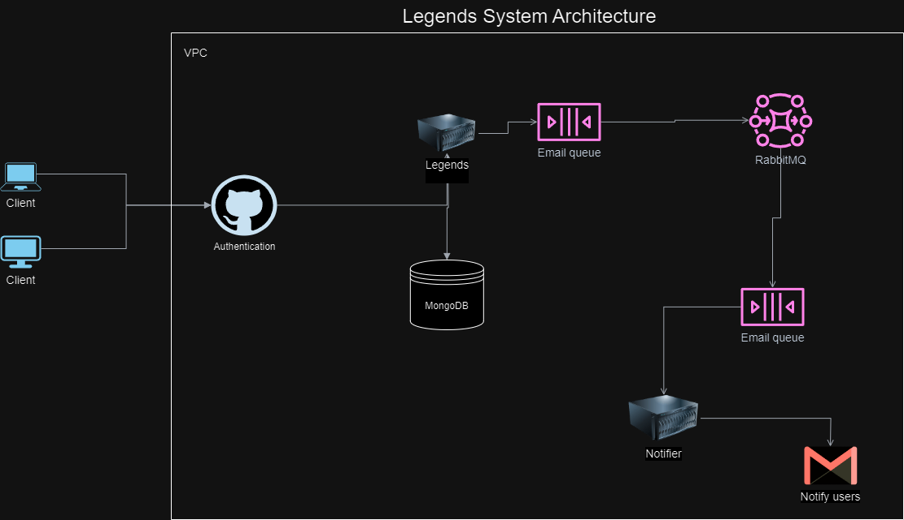

[**Legends by Siyama**](https://legends-5g0z.onrender.com/swagger-ui/index.html?continue)

## Table of Contents
1. [Introduction](#introduction)
2. [Key features](#key-features)
3. [Getting Started](#getting-Started)
4. [Stack used](#stack-used)
5. [To be added](#to-be-added)
6. [Design Architecture](#design-architecture)
7. [Disclaimer](#disclaimer)

# Introduction

This project is an event planning service designed to streamline the process of organizing successful events.
It allows team members to assign tasks and items required for an event, ensuring clear responsibility and accountability.

# Key-features
* Organization Creation: Users can create organizations and manage them effectively.
* Team Management: Within each organization, users can create various teams (e.g., Marketing, Sales, Organizers) and assign team members to these teams.
* Organizational Structure: Team members belong to departments, and departments belong to organizations. This structure provides clarity and order.
* Flexibility in Roles: A team member can have multiple roles in a project, allowing for flexible collaboration and utilization of skills.
* Task Assignment: Team members can assign tasks and items to each other, making sure that all necessary elements for the event are covered.
* Notifications: The service will notify each assigned team member when they are assigned a task or item, keeping everyone informed and on track.

# Getting-Started
To get started with Legends, follow these steps:
Create an Organization: Set up your organization to start planning your events.
Create Teams: Within your organization, create teams based on your needs, such as Marketing, Sales, or Organizers.
Assign Team Members: Add team members to your teams, assigning them roles and responsibilities.
Plan Your Event: Create an event with the required details
Add items/resources needed for that event: Start assigning tasks and items required for your event to the appropriate team members.
Stay Notified: Ensure that all team members are notified of their assignments to keep the planning process smooth and efficient.

# Stack-used
* SpringBoot
* Java 17
* MongoDB
* RabbitMQ
* Docker
* Lombok

# To-be-added
* Mapstruct for mapping DTOs to domain objects

# Design-Architecture

# Disclaimer
**_To access the project and test, you will need to have a GitHub account:_**

